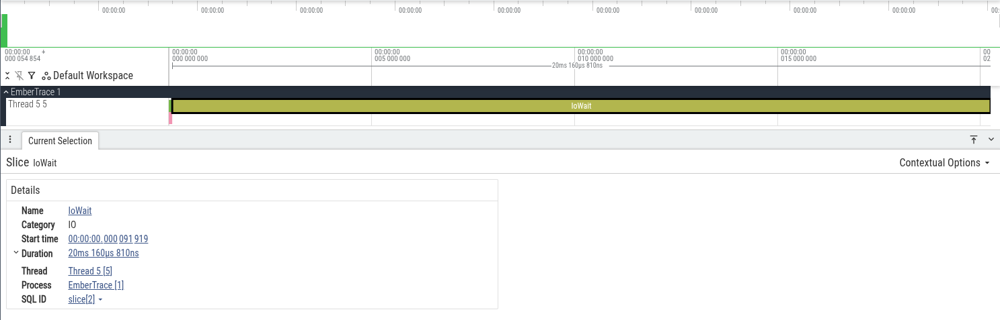

Русская версия: [./README.ru.md](./README.ru.md)

# EmberTrace

**EmberTrace** is a fast in-process tracer/profiler for .NET with minimal overhead on the hot path:

- **Allocation-free Begin/End** with a lock-free hot path (thread-local buffers; shared session state is touched only on
  chunk rotation and when a limit is configured)
- **Flows** for links between threads and `async/await`
- **Offline analysis** after stopping a session (aggregations + reports)
- **Export to Chrome Trace** (for `chrome://tracing` / Perfetto)
- **Flight recorder** - `Tracer.Snapshot()` dumps the last N seconds from a live session without stopping it

## Installation

The easiest option is the metapackage:

```bash
dotnet add package EmberTrace.All
```

If you install packages selectively:

- `EmberTrace` - runtime API (`Tracer.*`)
- `EmberTrace.Abstractions` - attributes (`[assembly: TraceId(...)]`)
- `EmberTrace.Generator` - source generator (automatically registers metadata)
- `EmberTrace.Analysis` - session processing (`session.Process()`)
- `EmberTrace.ReportText` - text report (`TraceText.Write(...)`)
- `EmberTrace.Export` - Chrome Trace export (`TraceExport.*`)
- `EmberTrace.Format` - binary session persistence (`TraceFormat.Write/Read`)
- `EmberTrace.OpenTelemetry` - export to OpenTelemetry (`Activity` spans)
- `EmberTrace.Testing` - performance assertions and baseline diffing for tests (`stats.Scope(...)`, `TraceBudget`)
- `EmberTrace.RoslynAnalyzers` - analyzers and code fixes for correct usage (fixes run in IDE and are included in the
  package)

## Quick Start

1) Define IDs and metadata (in any project file, at the assembly level):

```csharp
using EmberTrace.Abstractions.Attributes;

[assembly: TraceId(1000, "App", "App")]
[assembly: TraceId(2000, "Worker", "Workers")]
```

2) Wrap the required sections in scopes:

```csharp
using EmberTrace;

Tracer.Start();

using (Tracer.Scope(1000))
{
    // работа
}

var session = Tracer.Stop();
```

3) Generate a report and/or export:

```csharp
var processed = session.Process();
var meta = Tracer.CreateMetadata(); // if generator is used — metadata will be registered automatically

Console.WriteLine(TraceText.Write(processed, meta: meta, topHotspots: 20, maxDepth: 8));

using var fs = File.Create("out/trace.json");
TraceExport.WriteChromeComplete(session, fs, meta: meta);
```

4) Open `out/trace.json`:

- `chrome://tracing` (Chrome)
- Perfetto (web UI) - convenient for large traces

## Repository Example

The most complete example is `samples/EmberTrace.DocScreenshots` (scopes + flows + async + export + text report):

```bash
dotnet run --project samples/EmberTrace.DocScreenshots -c Release
# files will be in samples/EmberTrace.DocScreenshots/out
```

## Documentation

- [Index](docs/index.md)
- [Quick Start](docs/guides/getting-started/README.md)
- [Usage and API](docs/guides/usage/README.md)
- [Flow and async](docs/concepts/flows/README.md)
- [Export](docs/guides/export/README.md)
- [Analysis and reports](docs/guides/analysis/README.md)
- [Flight recorder](docs/guides/flight-recorder/README.md)
- [Generator and metadata](docs/reference/source-generator/README.md)
- [Troubleshooting](docs/troubleshooting/README.md)

## Build and Tests

Requires the SDK specified in `global.json`.

```bash
dotnet build -c Release
dotnet test -c Release
```

## Benchmarks and AOT

```bash
dotnet run --project benchmarks/EmberTrace.Benchmarks -c Release -- --filter *ScopeBenchmarks*
```

```bash
dotnet publish samples/EmberTrace.NativeAot -c Release -p:PublishAot=true
```

## Screenshots

**Example of a simple trace in Perfetto**



## Useful Links

- Documentation: [docs/index.md](docs/index.md)
- Examples: [samples/](samples/)
