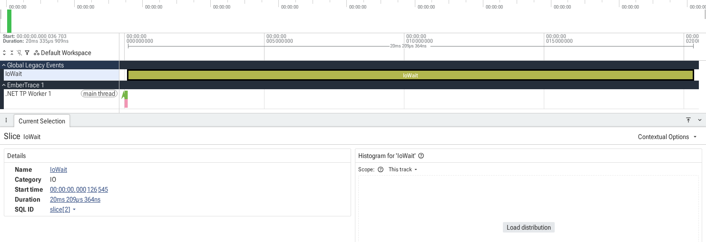
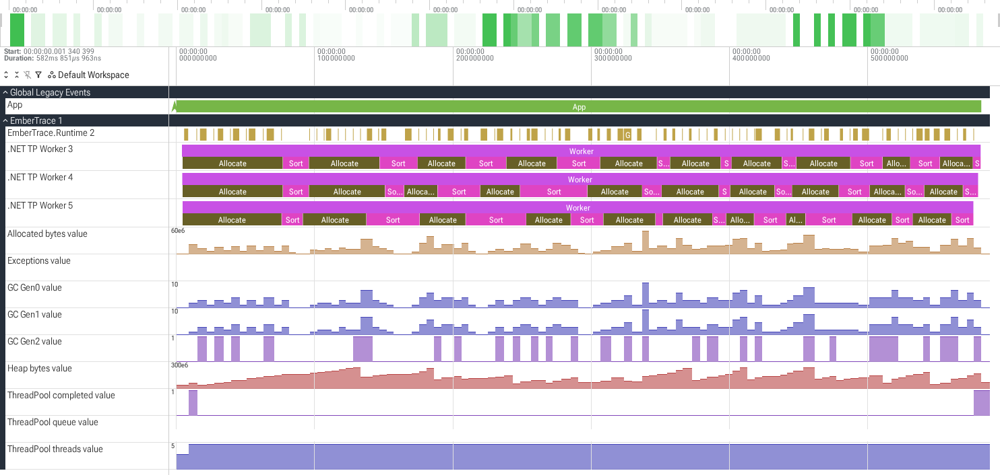
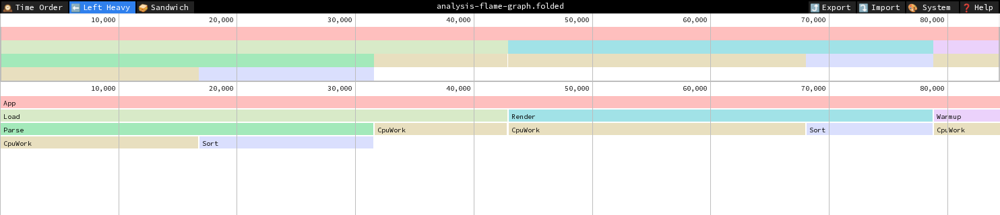

English version: [./README.md](./README.md)

# EmberTrace

**EmberTrace** — быстрый *in-process* tracer/profiler для .NET с минимальной нагрузкой на горячем пути:
- **`Scope`, `Instant`, `Counter` и `FlowStart`/`FlowStep`/`FlowEnd` без аллокаций** и lock-free горячий путь (thread-local буферы;
  общее состояние сессии затрагивается только при ротации чанка и при заданном лимите). `ScopeAsync`
  аллоцирует около 224 байт на scope, чтобы пронести родителя через `await`; сгенерированный `[Trace]`
  async-метод платит примерно половину
- **Flows** для связей между потоками и `async/await`
- **Offline-анализ** после остановки сессии (агрегации + отчёты)
- **Экспорт в Chrome Trace** (для `chrome://tracing` / Perfetto)
- **Flight recorder** — `Tracer.Snapshot()` выгружает последние N секунд из живой сессии, не останавливая её
- **Автоинструментация** — `[Trace]` на `partial`-методе генерирует обёртку со scope, id и метаданные;
  `[Trace]` на классе генерирует DI-декоратор для всего сервиса

## Установка

Самый простой вариант — метапакет:

```bash
dotnet add package EmberTrace.All
```

Если подключаешь выборочно:

- `EmberTrace` — runtime API (`Tracer.*`)
- `EmberTrace.Abstractions` — атрибуты (`[assembly: TraceId(...)]`)
- `EmberTrace.Generator` — source generator (автоматически регистрирует метаданные)
- `EmberTrace.Analysis` — обработка сессии (`session.Process()`)
- `EmberTrace.ReportText` — текстовый отчёт (`TraceText.Write(...)`)
- `EmberTrace.Export` — Chrome Trace export (`TraceExport.*`)
- `EmberTrace.Format` — бинарное сохранение сессии (`TraceFormat.Write/Read`)
- `EmberTrace.OpenTelemetry` — экспорт в OpenTelemetry (`Activity`-спаны)
- `EmberTrace.Extensions.Hosting` — интеграция с ASP.NET Core (`AddEmberTrace()`, middleware для запросов, `appsettings.json`, `/embertrace/dump`)
- `EmberTrace.Testing` — проверки производительности и сравнение с базовой линией в тестах (`stats.Scope(...)`, `TraceBudget`)
- `EmberTrace.RoslynAnalyzers` — анализаторы и code fixes для корректного использования (фиксы работают в IDE и идут в составе пакета)

## Быстрый старт

1) Опиши id и метаданные (в любом файле проекта, *на уровне assembly*):

```csharp
using EmberTrace.Abstractions.Attributes;

[assembly: TraceId(1000, "App", "App")]
[assembly: TraceId(2000, "Worker", "Workers")]
```

2) Оберни нужные участки в scopes:

```csharp
using EmberTrace;

Tracer.Start();

using (Tracer.Scope(1000))
{
    // работа
}

var session = Tracer.Stop();
```

3) Сними отчёт и/или экспорт:

```csharp
var processed = session.Process();
var meta = Tracer.CreateMetadata(); // если подключён generator — метаданные будут зарегистрированы автоматически

Console.WriteLine(TraceText.Write(processed, meta: meta, topHotspots: 20, maxDepth: 8));

using var fs = File.Create("out/trace.json");
TraceExport.WriteChromeComplete(session, fs, meta: meta);
```

4) Открой `out/trace.json`:
- `chrome://tracing` (Chrome)
- Perfetto (веб-UI) — удобно для больших трасс

## Примеры из репозитория

| Пример | Что показывает |
|--------|----------------|
| [`BasicTracing`](samples/EmberTrace.BasicTracing) | scopes, текстовый отчёт с перцентилями, Chrome Trace, collapsed stacks, запись и чтение `.ember` |
| [`ParallelWorkers`](samples/EmberTrace.ParallelWorkers) | рабочие потоки, flows и `AnalyzeFlows`, runtime-счётчики |
| [`AutoInstrumentation`](samples/EmberTrace.AutoInstrumentation) | `[Trace]` на `partial`-методах |
| [`FlightRecorder`](samples/EmberTrace.FlightRecorder) | `Tracer.Snapshot()` поверх ограниченного буфера `DropOldest` |
| [`WebApi`](samples/EmberTrace.WebApi) | интеграция с ASP.NET Core, `/embertrace/dump`, захват медленных запросов |
| [`NativeAot`](samples/EmberTrace.NativeAot) | публикация NativeAOT |
| [`DocScreenshots`](samples/EmberTrace.DocScreenshots) | все сценарии, из которых получены изображения в `docs/assets` |

```bash
dotnet run --project samples/EmberTrace.BasicTracing -c Release -p:UseLocalEmberTrace=true
# файлы появятся в ./out
```

`-p:UseLocalEmberTrace=true` собирает пример на исходниках из этого репозитория, а не на опубликованных пакетах.

Изображения и отчёты в `docs/assets` перегенерируются командой
`python3 samples/EmberTrace.DocScreenshots/capture.py` (нужны Playwright с Chromium и Pygments).

## Документация

- [Индекс](docs/index.ru.md)
- [Быстрый старт](docs/guides/getting-started/README.ru.md)
- [Использование и API](docs/guides/usage/README.ru.md)
- [Flow и async](docs/concepts/flows/README.ru.md)
- [Экспорт](docs/guides/export/README.ru.md)
- [Анализ и отчёты](docs/guides/analysis/README.ru.md)
- [Flight recorder](docs/guides/flight-recorder/README.ru.md)
- [Генератор и метаданные](docs/reference/source-generator/README.ru.md)
- [Автоинструментация через [Trace]](docs/guides/auto-instrumentation/README.ru.md)
- [Устранение неполадок](docs/troubleshooting/README.ru.md)

## Сборка и тесты

Требуется SDK, указанный в `global.json`.

```bash
dotnet build -c Release
dotnet test -c Release
```

## Бенчмарки и AOT

```bash
dotnet run --project benchmarks/EmberTrace.Benchmarks -c Release -- --filter *ScopeBenchmarks*
```

```bash
dotnet publish samples/EmberTrace.NativeAot -c Release -p:PublishAot=true
```

## Скриншоты

**Пример простой трассы в Perfetto**



**Runtime-счётчики рядом со scopes**



**Flame graph в speedscope**



## Полезные ссылки

- Документация: [docs/index.md](docs/index.ru.md)
- Примеры: [samples/](samples/)
