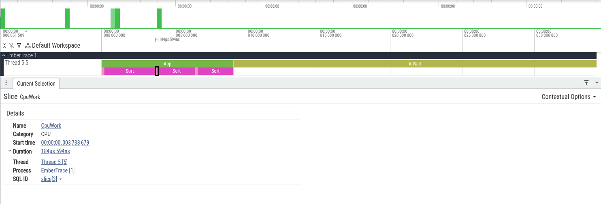

Русская версия: [./README.ru.md](./README.ru.md)

# Analysis and reports

After `Tracer.Stop()`, you can perform heavy trace processing: compute aggregates and print a report.

## Processing

```csharp
var session = Tracer.Stop();
var processed = session.Process();
```

`Process()` builds aggregates by id and call tree (by threads), which are convenient to:
- print in a report
- compare across runs
- use in your own tools
`ProcessedTrace` also stores dropped/sampled counters and stack errors.

Additional modes:

```csharp
var processed = session.Process(strict: true, groupByThread: false);
```

- `strict` - does not attempt stack repair for mismatched end
- `groupByThread` - when `false`, builds a global call tree

One `ThreadTrace` is one writer track, not one managed thread id: `TrackId` is what the tree was grouped
by, `ThreadId` is the managed thread that wrote it and is there for display. Two entries can therefore
carry the same `ThreadId` when the runtime recycled it during the session, and `ThreadsSeen` counts
tracks, so it does not undercount in that case.

For lightweight diagnostics:

```csharp
var stats = session.Analyze(strict: true);
```

Flow chain analysis is also available:

```csharp
var flows = session.AnalyzeFlows(top: 10);
```

## Percentiles

`Analyze()` attaches a duration distribution to every id:

```csharp
var stats = session.Analyze();

foreach (var row in stats.ByTotalTimeDesc)
    Console.WriteLine($"{row.Id}: p50={row.P50Ms:F3} p95={row.P95Ms:F3} p99={row.P99Ms:F3} max={row.MaxMs:F3}");
```

`row.Durations` is the underlying `DurationHistogram` when an arbitrary percentile is needed:
`row.Durations.PercentileTicks(99.9)`.

`Process()` attaches the same distribution to every `HotspotRow` as `P50Ms`, `P95Ms` and `P99Ms`.

Durations are bucketed with 5 significant bits: at most 3.125% relative error, always rounded up,
exact below 64 ticks. `MinMs` and `MaxMs` are exact.

## Text report

```csharp
var meta = Tracer.CreateMetadata();

var text = TraceText.Write(
    processed,
    meta: meta,
    topHotspots: 20,
    maxDepth: 8,
    categoryFilter: "IO",
    minPercent: 1,
    includePercentiles: true);

Console.WriteLine(text);
```

Parameters:
- `topHotspots` - number of hotspot lines to show
- `maxDepth` - call tree depth
- `categoryFilter` - category filter
- `minPercent` - minimum percentage to display
- `includePercentiles` - adds p50/p95/p99 columns to the hotspots table

See also:
- [Performance testing and regression gates](../testing/README.md)
- [Export](../export/README.md)
- [Usage and API](../usage/README.md)

## Screenshots



## Links

- [**Analysis slice**](../../assets/analysis-slice.txt)
