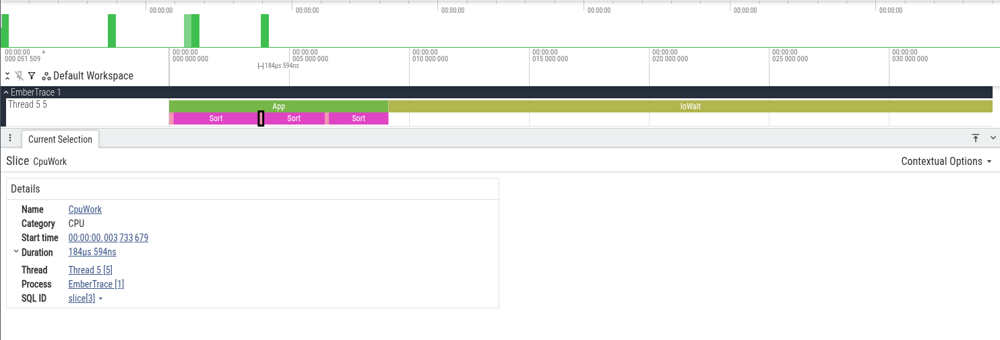

# Анализ и отчёты

После `Tracer.Stop()` можно «тяжело» обработать трассу: посчитать агрегаты и вывести отчёт.

## Обработка

```csharp
var session = Tracer.Stop();
var processed = session.Process();
```

`Process()` строит агрегаты по id и call-tree (по потокам), которые удобно:
- печатать в отчёте
- сравнивать между прогонами
- использовать в своих тулзах
В `ProcessedTrace` также сохраняются счётчики dropped/sampled и ошибки стека.

Дополнительные режимы:

```csharp
var processed = session.Process(strict: true, groupByThread: false);
```

- `strict` — не пытается «ремонтировать» стек при mismatched end
- `groupByThread` — если `false`, строится общий call tree

Для лёгкой диагностики:

```csharp
var stats = session.Analyze(strict: true);
```

Также доступен анализ flow‑цепочек:

```csharp
var flows = session.AnalyzeFlows(top: 10);
```

## Текстовый отчёт

```csharp
var meta = Tracer.CreateMetadata();

var text = TraceText.Write(
    processed,
    meta: meta,
    topHotspots: 20,
    maxDepth: 8,
    categoryFilter: "IO",
    minPercent: 1);

Console.WriteLine(text);
```

Параметры:
- `topHotspots` — сколько строк «горячих точек» показать
- `maxDepth` — глубина дерева вызовов
- `categoryFilter` — фильтр по категории
- `minPercent` — минимальный процент для вывода

См. также:
- [Экспорт](../export/README.md)
- [Использование и API](../usage/README.md)

## Скриншоты



## Ссылки

- [**Analysis slice**](../../assets/analysis-slice.txt)
