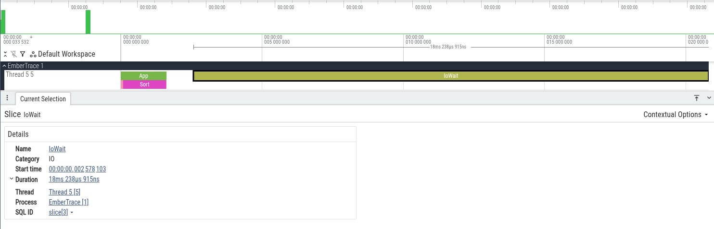

Русская версия: [./README.ru.md](./README.ru.md)

# Export

EmberTrace exports a session to the Chrome Trace JSON format understood by:
- `chrome://tracing`
- Perfetto (web UI)

## WriteChromeComplete

Recommended format: complete events (durations packed into one object).

```csharp
var session = Tracer.Stop();
var meta = Tracer.CreateMetadata();

Directory.CreateDirectory("out");
using var fs = File.Create("out/trace_complete.json");

TraceExport.WriteChromeComplete(session, fs, meta: meta);
```

Event ordering is stable: timestamp -> track -> sequence.

## WriteChromeBeginEnd

Alternative: separate Begin/End events (can be more convenient for some tools).

```csharp
using var fs = File.Create("out/trace_beginend.json");
TraceExport.WriteChromeBeginEnd(session, fs, meta: meta);
```

Export includes:
- Flow (`FlowStart/Step/End`)
- Instant and Counter
- thread names (if set via `Thread.CurrentThread.Name`)

The Chrome `tid` is a writer track id, not a managed thread id: a track is one thread for the lifetime
of one session, so a thread that dies and lets the runtime hand its `ManagedThreadId` to a new thread
gets a row of its own instead of one spliced row. The managed thread id is what the row is named after,
through the emitted `thread_name` metadata.

## MarkedComplete: capture a short window

Useful when you do not want to manage `Start/Stop` manually around a small section.

```csharp
TraceExport.MarkedComplete(
    name: "WarmPath",
    outputPath: "out/warm_path.json",
    body: () =>
    {
        using var _ = Tracer.Scope(Ids.App);
        Work();
    });
```

## SliceAndResume: window inside an already running session

If a session is already running, you can slice a window and continue recording:

```csharp
var result = TraceExport.MarkedCompleteEx(
    name: "Slice",
    outputPath: "out/slice.json",
    body: () =>
    {
        using var _ = Tracer.Scope(Ids.App);
        Work();
    },
    running: MarkedRunningSessionMode.SliceAndResume,
    resumeOptions: new SessionOptions { ChunkCapacity = 64 * 1024 });

result.SaveFullChromeComplete("out/slice_full.json", meta: Tracer.CreateMetadata());
```

See also:
- [Analysis and reports](../analysis/README.md)
- [Flow and async](../../concepts/flows/README.md)

## Screenshots


