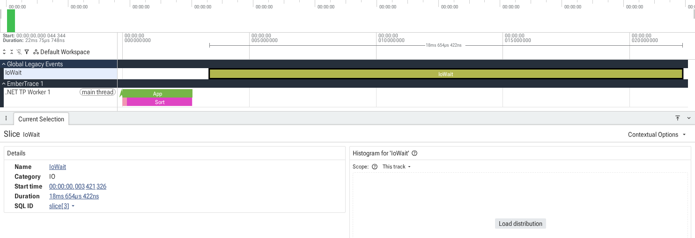

Русская версия: [./README.ru.md](./README.ru.md)

# Export

EmberTrace exports a session to the Chrome Trace JSON format understood by:
- `chrome://tracing`
- Perfetto (web UI)

## WriteChromeComplete

Recommended format: complete events (durations packed into one object).

```csharp
var session = Tracer.Stop();
var meta = Tracer.CreateMetadata();

Directory.CreateDirectory("out");
using var fs = File.Create("out/trace_complete.json");

TraceExport.WriteChromeComplete(session, fs, meta: meta);
```

Event ordering is stable: timestamp -> track -> sequence.

## WriteChromeBeginEnd

Alternative: separate Begin/End events (can be more convenient for some tools).

```csharp
using var fs = File.Create("out/trace_beginend.json");
TraceExport.WriteChromeBeginEnd(session, fs, meta: meta);
```

Export includes:
- Flow (`FlowStart/Step/End`)
- Instant and Counter
- thread names (if set via `Thread.CurrentThread.Name`)

The Chrome `tid` is a writer track id, not a managed thread id: a track is one thread for the lifetime
of one session, so a thread that dies and lets the runtime hand its `ManagedThreadId` to a new thread
gets a row of its own instead of one spliced row. The managed thread id is what the row is named after,
through the emitted `thread_name` metadata.

## MarkedComplete: capture a short window

Useful when you do not want to manage `Start/Stop` manually around a small section.

```csharp
TraceExport.MarkedComplete(
    "WarmPath",
    () =>
    {
        using var _ = Tracer.Scope(Ids.App);
        Work();
    },
    new MarkedCompleteOptions { OutputPath = "out/warm_path.json" });
```

`MarkedCompleteOptions` carries everything else: `Unique` appends the caller's line number to the
name, `Pid` and `ProcessName` label the process in the viewer. Without `OutputPath` the file goes to
`traces/<name>_<utc timestamp>.json`. `MarkedCompleteAsync` takes a `Func<Task>` body.

## SliceAndResume: window inside an already running session

If a session is already running, `MarkedComplete` throws unless you ask it to slice that session:

```csharp
var result = TraceExport.MarkedComplete(
    "Slice",
    () =>
    {
        using var _ = Tracer.Scope(Ids.App);
        Work();
    },
    new MarkedCompleteOptions
    {
        OutputPath = "out/slice.json",
        Running = MarkedRunningSessionMode.SliceAndResume
    });

result.SaveFullChromeComplete("out/slice_full.json", meta: Tracer.CreateMetadata());
```

The running session is not stopped: the slice is cut from a snapshot, so a flight recorder keeps
its history and other threads keep recording while the body runs. `result.CapturedSession` is that
snapshot (`IsSnapshot` is `true`).

To work on a session of your own instead of the global `Tracer`, pass it in the options:

```csharp
using var tracing = new TracingSession();

TraceExport.MarkedComplete("Import", () => Import(tracing),
    new MarkedCompleteOptions { Session = tracing, OutputPath = "out/import.json" });
```

## Migrating from 0.3

The overloads marked obsolete in 0.3 are gone in 0.4. Every one of them maps onto the options call:

| 0.3 | 0.4 |
|---|---|
| `MarkedComplete(name, outputPath, body)` | `MarkedComplete(name, body, new MarkedCompleteOptions { OutputPath = outputPath })` |
| `MarkedComplete(name, body)` | `MarkedComplete(name, body, default)` |
| `MarkedCompleteEx(...)` | `MarkedComplete(...)` — it already returns `MarkedCompleteResult` |
| `MarkedCompleteUnique(...)`, `MarkedCompleteExUnique(...)` | `new MarkedCompleteOptions { Unique = true }` |
| `running:`, `pid:`, `processName:` arguments | `Running`, `Pid`, `ProcessName` properties |
| overloads without a name (name taken from the calling member) | pass `nameof(TheCallingMethod)` |
| a `TraceSession` return value | `result.CapturedSession` |
| `...Async` variants | the same replacements on `MarkedCompleteAsync` |
| `resumeOptions:` argument / `ResumeOptions` property | removed — the session is no longer restarted |

See also:
- [Analysis and reports](../analysis/README.md)
- [Flow and async](../../concepts/flows/README.md)

## Screenshots


