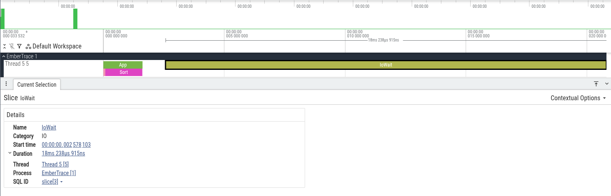

# Экспорт

EmberTrace экспортирует сессию в JSON-формат Chrome Trace, который понимают:
- `chrome://tracing`
- Perfetto (веб-UI)

## WriteChromeComplete

Рекомендуемый формат: «complete events» (длительности упакованы в один объект).

```csharp
var session = Tracer.Stop();
var meta = Tracer.CreateMetadata();

Directory.CreateDirectory("out");
using var fs = File.Create("out/trace_complete.json");

TraceExport.WriteChromeComplete(session, fs, meta: meta);
```

Порядок событий стабилен: timestamp → thread → sequence.

## WriteChromeBeginEnd

Альтернатива: отдельные Begin/End события (может быть удобнее для некоторых тулов).

```csharp
using var fs = File.Create("out/trace_beginend.json");
TraceExport.WriteChromeBeginEnd(session, fs, meta: meta);
```

Экспорт включает:
- Flow (`FlowStart/Step/End`)
- Instant и Counter
- имена потоков (если заданы через `Thread.CurrentThread.Name`)

## MarkedComplete: снять короткое окно

Полезно, когда не хочешь вручную управлять `Start/Stop` вокруг небольшого участка.

```csharp
TraceExport.MarkedComplete(
    name: "WarmPath",
    outputPath: "out/warm_path.json",
    body: () =>
    {
        using var _ = Tracer.Scope(Ids.App);
        Work();
    });
```

## SliceAndResume: окно внутри уже идущей сессии

Если сессия уже запущена, можно «срезать» окно и продолжить запись:

```csharp
var result = TraceExport.MarkedCompleteEx(
    name: "Slice",
    outputPath: "out/slice.json",
    body: () =>
    {
        using var _ = Tracer.Scope(Ids.App);
        Work();
    },
    running: MarkedRunningSessionMode.SliceAndResume,
    resumeOptions: new SessionOptions { ChunkCapacity = 64 * 1024 });

result.SaveFullChromeComplete("out/slice_full.json", meta: Tracer.CreateMetadata());
```

См. также:
- [Анализ и отчёты](../analysis/README.md)
- [Flow и async](../../concepts/flows/README.md)

## Скриншоты



