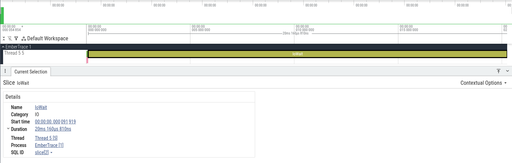

# Быстрый старт

Цель: зафиксировать первую трассу, получить текстовый отчёт и открыть её в Chrome Trace.

## Требования

- .NET SDK: см. `global.json` (в репозитории используется `net10.0`)

## 1) Подключение пакетов

### Вариант A: один пакет

```bash
dotnet add package EmberTrace.All
```

### Вариант B: выборочно

Минимум для runtime-трассировки:

```bash
dotnet add package EmberTrace
```

Чтобы были **имена/категории** в экспорте и отчётах:

```bash
dotnet add package EmberTrace.Abstractions
dotnet add package EmberTrace.Generator
```

> `EmberTrace.Generator` — source generator. Он собирает `[assembly: TraceId(...)]` и автоматически
> регистрирует метаданные (через `ModuleInitializer`).

## 2) Описать TraceId (метаданные)

Добавь атрибуты на уровне assembly (например, в `TraceIds.cs`):

```csharp
using EmberTrace.Abstractions.Attributes;

[assembly: TraceId(1000, "App", "App")]
[assembly: TraceId(2000, "Worker", "Workers")]
[assembly: TraceId(2100, "IoWait", "IO")]
```

Рекомендации:
- держи диапазоны по модулям/подсистемам (например, `1000–1999`, `2000–2999`…)
- имена — короткие и стабильные (они уйдут в отчёты/экспорт)

## 3) Инструментировать код

```csharp
using EmberTrace;

Tracer.Start();

using (Tracer.Scope(1000))
{
    // работа
}

var session = Tracer.Stop();
```

Важно:
- `Scope` — `ref struct`: **нельзя** переносить через `await`. Для `async` используй `ScopeAsync`.

```csharp
await using (Tracer.ScopeAsync(2100))
{
    await Task.Delay(50);
}
```

## 4) Отчёт и экспорт

### Текстовый отчёт

```csharp
var processed = session.Process();
var meta = Tracer.CreateMetadata();

Console.WriteLine(TraceText.Write(processed, meta: meta, topHotspots: 20, maxDepth: 8));
```

### Chrome Trace (JSON)

```csharp
Directory.CreateDirectory("out");

using var fs = File.Create("out/trace.json");
TraceExport.WriteChromeComplete(session, fs, meta: meta);
```

Открыть:
- `chrome://tracing` (Chrome)
- Perfetto (веб-UI) — подходит для больших трасс

## 5) Демо-проект (рекомендуется)

В репозитории есть готовый сценарий со scopes + flows + async + экспорт + отчёт:

```bash
dotnet run --project samples/EmberTrace.Demo3 -c Release
# выходные файлы: samples/EmberTrace.Demo3/out
```

Дальше:
- [Использование и API](../usage/README.md)
- [Flow и async](../../concepts/flows/README.md)

## Скриншоты



## Ссылки

- [**Getting started**](../../assets/getting-started-first-trace.txt)
