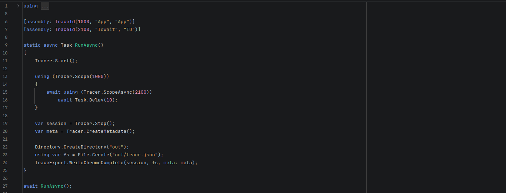

# Использование и API

Эта страница — практический справочник по runtime API (`EmberTrace`) и типовым паттернам.

## Жизненный цикл

Одна сессия = один интервал между `Start()` и `Stop()`.

```csharp
Tracer.Start();

using (Tracer.Scope(Ids.App))
{
    // ...
}

var session = Tracer.Stop();
```

Примечания:
- вложенные `Scope` допускаются (получится call-tree)
- события собираются в **thread-local** буферы; тяжёлая обработка — после `Stop()`

## Scopes

### Sync: `Tracer.Scope(int id)`

`Scope` — `ref struct` (минимальный overhead). Его **нельзя** держать через `await`.

```csharp
using (Tracer.Scope(Ids.Cpu))
{
    CpuWork();
}
```

### Async: `Tracer.ScopeAsync(int id)`

```csharp
await using (Tracer.ScopeAsync(Ids.Io))
{
    await Task.Delay(10);
}
```

## Идентификаторы (TraceId)

EmberTrace работает с `int id`. Есть три удобных стратегии:

1) **Константы в коде** (самый явный вариант)

```csharp
static class Ids
{
    public const int App = 1000;
    public const int Io  = 2100;
}
```

2) **Стабильный id из строки** (когда не хочешь держать таблицу констант)

```csharp
var id = Tracer.Id("MySubsystem.Request");
using var _ = Tracer.Scope(id);
```

Категорию можно хешировать так же:

```csharp
var ioCategory = Tracer.CategoryId("IO");
```

3) **Метаданные через `[assembly: TraceId(...)]`** — для красивых имён/категорий в отчёте и экспорте
(см. docs: generator).

## Настройки сессии

```csharp
Tracer.Start(new SessionOptions
{
    ChunkCapacity = 128 * 1024,
    OverflowPolicy = OverflowPolicy.DropNew
});
```

- `ChunkCapacity` — размер чанка событий в буфере потока
- `OverflowPolicy` — поведение при переполнении (`DropNew`, `DropOldest`, `StopSession`)
- `MaxTotalEvents` / `MaxTotalChunks` — лимиты на общий объём
- `MaxEventsPerSecond` — лимит событий в секунду на writer
- `SampleEveryNGlobal` / `SampleEveryNById` — sampling без глобальных lock
- `EnabledCategoryIds` / `DisabledCategoryIds` — фильтрация категорий

## Session API

После остановки сессии:

- `session.EventCount` — общее число событий
- `session.EnumerateEvents()` — сырые события (для своих инструментов)
- `session.EnumerateEventsSorted()` — стабильная сортировка по timestamp → thread → sequence
- `session.Process()` — агрегаты для отчётов/аналитики

```csharp
var processed = session.Process();
```

## Метаданные

Метаданные нужны, чтобы id превращались в человекочитаемые имена/категории.

```csharp
var meta = Tracer.CreateMetadata();
```

Если подключён `EmberTrace.Generator`, метаданные из `[assembly: TraceId(...)]` будут
**автоматически зарегистрированы** при старте модуля (см. [генератор](../../reference/source-generator/README.md)).

Для dev‑сценариев можно включить runtime‑метаданные: `EnableRuntimeMetadata = true`.
В этом режиме `Tracer.Id("Name")` автоматически регистрирует имя с категорией `Default`.

## Практические рекомендации

- Инструментируй **крупные** участки горячего пути и внешние ожидания (IO/lock/await), а не каждую строку.
- Стабилизируй id: либо диапазоны констант, либо `Tracer.Id("...")` с фиксированными строками.
- Для `async` всегда используй `ScopeAsync`, иначе компилятор/рантайм ограничат сценарий.

См. также:
- [Flow и async](../../concepts/flows/README.md)
- [Экспорт](../export/README.md)
- [Анализ и отчёты](../analysis/README.md)

## Скриншоты


