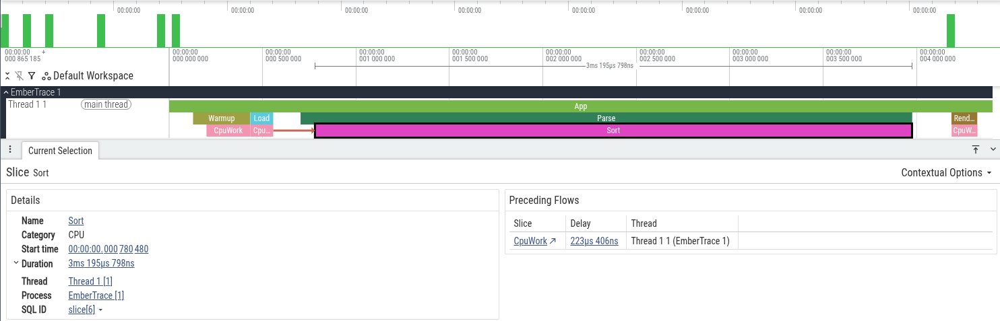

# Tracer

`Tracer` — публичная точка входа для записи трассы (scopes, flows) и управления сессией.

> Namespace: `EmberTrace`  
> Source: `src/EmberTrace/Api/Tracer.cs`

---

## Быстрый пример

```csharp
using EmberTrace;

var parseId = Tracer.Id("parse");
var flowStepId = Tracer.Id("flow.step");

Tracer.Start();

using (Tracer.Scope(parseId))
{
    var flowId = Tracer.FlowStartNew(flowStepId);
    Tracer.FlowStep(flowStepId, flowId);
    Tracer.FlowEnd(flowStepId, flowId);
}

var session = Tracer.Stop();
// дальше: экспорт / отчёт (см. [Экспорт](../../guides/export/README.md) и [Анализ](../../guides/analysis/README.md))
```

---

## Управление сессией

### `bool Tracer.IsRunning`
`true`, если профайлер активен и события пишутся.

### `void Tracer.Start(SessionOptions? options = null)`
Запускает запись событий.

- `options = null` → используются значения по умолчанию (см. `SessionOptions`).

### `TraceSession Tracer.Stop()`
Останавливает запись и возвращает `TraceSession` с собранными событиями.

---

## Scopes

### `Scope Tracer.Scope(int id)`
Открывает scope в текущем потоке и возвращает `Scope` (stack-only `ref struct`).

- Используй **только** в синхронном коде (scope нельзя «пронести» через `await`).
- Тип `Scope` вызывает `Profiler.End(id)` в `Dispose()`.

Пример:

```csharp
using (Tracer.Scope(Tracer.Id("load")))
{
    Load();
}
```

### `AsyncScope Tracer.ScopeAsync(int id)`
Async-friendly scope, реализующий `IAsyncDisposable`.

- Создание делает `Profiler.Scope(id)` только если `Tracer.IsRunning == true`.
- `DisposeAsync()` завершает scope через `Profiler.End(id)`.

Пример:

```csharp
await using var _ = Tracer.ScopeAsync(Tracer.Id("io"));
await DoIoAsync();
```

> Зачем два API: `Scope` — `ref struct` (быстрее/без аллокаций), но несовместим с `await`.
> Для async-кода используй `ScopeAsync`.

---

## Flows

Flows — связанный набор событий (start/step/end), который можно «переносить» через async/threads.

### `long Tracer.NewFlowId()`
Генерирует новый `flowId` (уникальный в рамках процесса).

### `long Tracer.FlowStartNew(int id)`
Создаёт новый `flowId`, пишет `FlowStart` и возвращает `flowId`.

### `void Tracer.FlowStart(int id, long flowId)`
Пишет `FlowStart` для указанного `flowId`.

### `void Tracer.FlowStep(int id, long flowId)`
Пишет `FlowStep` для указанного `flowId`.

### `void Tracer.FlowEnd(int id, long flowId)`
Пишет `FlowEnd` для указанного `flowId`.

### `FlowHandle Tracer.FlowStartNewHandle(int id)`
Удобная обёртка над flow:

- создаёт flow и возвращает `FlowHandle` с методами `Step()` / `End()`
- `End()` у `FlowHandle` идемпотентен (повторные вызовы безопасны)

### `void Tracer.FlowStep(FlowHandle handle)`
Вызывает `handle.Step()`.

### `void Tracer.FlowEnd(FlowHandle handle)`
Вызывает `handle.End()`.

---

## Metadata

### `ITraceMetadataProvider Tracer.CreateMetadata()`
Создаёт дефолтный провайдер метаданных (имена, категории и т.п.) для последующей интерпретации трассы.

---

## ID Helpers

### `int Tracer.Id(string name)`
Стабильный `int`-идентификатор по строке.

- Детерминированный: одинаковая строка → одинаковый `id`.
- Возможны коллизии (как у любого 32-bit хэша), поэтому для «критичных» ID лучше опираться на generator/TraceId.

---

## Скриншоты


