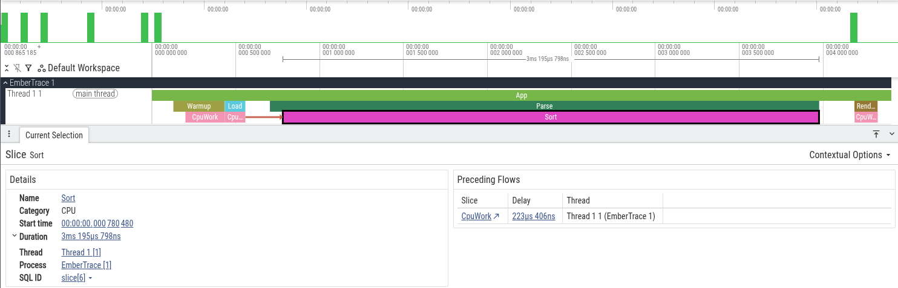

Русская версия: [./tracer.ru.md](./tracer.ru.md)

# Tracer

`Tracer` is the public entry point for trace recording (scopes, flows) and session control.

> Namespace: `EmberTrace`  
> Source: `src/EmberTrace/Api/Tracer.cs`

---

## Quick example

```csharp
using EmberTrace;

var parseId = Tracer.Id("parse");
var flowStepId = Tracer.Id("flow.step");

Tracer.Start();

using (Tracer.Scope(parseId))
{
    var flowId = Tracer.FlowStartNew(flowStepId);
    Tracer.FlowStep(flowStepId, flowId);
    Tracer.FlowEnd(flowStepId, flowId);
}

var session = Tracer.Stop();
// дальше: экспорт / отчёт (см. [Экспорт](../../guides/export/README.md) и [Анализ](../../guides/analysis/README.md))
```

---

## Session control

### `bool Tracer.IsRunning`
`true` if the profiler is active and events are being written.

### `void Tracer.Start(SessionOptions? options = null)`
Starts event recording.

- `options = null` -> default values are used (see `SessionOptions`).

### `TraceSession Tracer.Stop()`
Stops recording and returns `TraceSession` with collected events.

---

## Scopes

### `Scope Tracer.Scope(int id)`
Opens a scope on the current thread and returns `Scope` (stack-only `ref struct`).

- Use **only** in synchronous code (a scope cannot be carried across `await`).
- `Scope` calls `Profiler.End(id)` in `Dispose()`.

Example:

```csharp
using (Tracer.Scope(Tracer.Id("load")))
{
    Load();
}
```

### `AsyncScope Tracer.ScopeAsync(int id)`
Async-friendly scope implementing `IAsyncDisposable`.

- Construction calls `Profiler.Scope(id)` only if `Tracer.IsRunning == true`.
- `DisposeAsync()` closes the scope via `Profiler.End(id)`.

Example:

```csharp
await using var _ = Tracer.ScopeAsync(Tracer.Id("io"));
await DoIoAsync();
```

> Why two APIs: `Scope` is a `ref struct` (faster/allocation-free), but incompatible with `await`.
> Use `ScopeAsync` for async code.

---

## Flows

Flows are a linked set of events (start/step/end) that can be propagated across async/threads.

### `long Tracer.NewFlowId()`
Generates a new `flowId` (unique within the process).

### `long Tracer.FlowStartNew(int id)`
Creates a new `flowId`, writes `FlowStart`, and returns `flowId`.

### `FlowScope Tracer.Flow(int id)`
Convenient scope variant: creates a flow and ends it in `Dispose()`.

### `void Tracer.FlowStart(int id, long flowId)`
Writes `FlowStart` for the specified `flowId`.

### `void Tracer.FlowStep(int id, long flowId)`
Writes `FlowStep` for the specified `flowId`.

### `void Tracer.FlowEnd(int id, long flowId)`
Writes `FlowEnd` for the specified `flowId`.

### `long Tracer.FlowFromActivityCurrent(int id)`
If `Activity.Current` exists, creates a flow using its trace id.

### `FlowHandle Tracer.FlowStartNewHandle(int id)`
Convenient wrapper over flow:

- creates a flow and returns `FlowHandle` with `Step()` / `End()` methods
- `FlowHandle.End()` is idempotent (repeated calls are safe)

### `void Tracer.FlowStep(FlowHandle handle)`
Calls `handle.Step()`.

### `void Tracer.FlowEnd(FlowHandle handle)`
Calls `handle.End()`.

---

## Metadata

### `ITraceMetadataProvider Tracer.CreateMetadata()`
Creates the default metadata provider (names, categories, etc.) for trace interpretation.

If `SessionOptions.EnableRuntimeMetadata` is enabled, then `Tracer.Id("Name")` automatically
registers a name with category `Default`.

---

## ID Helpers

### `int Tracer.Id(string name)`
Stable string-based `int` identifier computed as a 31-bit FNV-1a hash.

- Deterministic: same string → same `id`.
- **Collision risk**: the hash space holds ~2.1 billion values. By the birthday paradox, the probability of the first collision reaches 50% around **46 000 unique names** — a realistic threshold in a large monorepo.
- Collision behaviour is controlled by `Tracer.IdCollisionMode` (see below).
- For projects with many unique trace names, prefer the source generator or `[TraceId]` attribute — they guarantee collision-free identifiers at compile time.

### `TracerIdCollisionMode Tracer.IdCollisionMode`
Controls what happens when two distinct names hash to the same value.

| Value | Behaviour | Default |
|-------|-----------|---------|
| `Warn` | Emits `Trace.TraceWarning` | **Yes** (all configurations) |
| `Throw` | Throws `InvalidOperationException` | — |
| `Ignore` | Silently keeps the first mapping; correctness not guaranteed | — |

> **Recommendation for CI**: set `Tracer.IdCollisionMode = TracerIdCollisionMode.Throw` early in your test entry point. This surfaces collisions immediately rather than letting them corrupt traces silently.

### `int Tracer.CategoryId(string category)`
Stable `int` identifier for categories (used in filters).

---

## Instant / Counter

### `void Tracer.Instant(int id)`
Writes an instant event.

### `void Tracer.Counter(int id, long value)`
Writes a counter value.

---

## Screenshots


