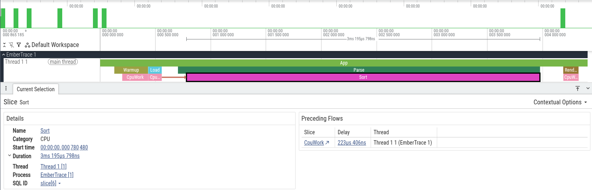

English version: [./tracer.md](./tracer.md)

# Tracer

`Tracer` — публичная точка входа для записи трассы (scopes, flows) и управления сессией.

> Namespace: `EmberTrace`  
> Source: `src/EmberTrace/Api/Tracer.cs`

---

## Быстрый пример

```csharp
using EmberTrace;

var parseId = Tracer.Id("parse");
var flowStepId = Tracer.Id("flow.step");

Tracer.Start();

using (Tracer.Scope(parseId))
{
    var flowId = Tracer.FlowStartNew(flowStepId);
    Tracer.FlowStep(flowStepId, flowId);
    Tracer.FlowEnd(flowStepId, flowId);
}

var session = Tracer.Stop();
// дальше: экспорт / отчёт - см. гайды «Экспорт» и «Анализ»
```

---

## Управление сессией

### `bool Tracer.IsRunning`
`true`, если профайлер активен и события пишутся.

### `void Tracer.Start(SessionOptions? options = null)`
Запускает запись событий.

- `options = null` → используются значения по умолчанию (см. `SessionOptions`).

### `TraceSession Tracer.Stop()`
Останавливает запись и возвращает `TraceSession` с собранными событиями.

### `TraceSession Tracer.Snapshot()`
### `TraceSession Tracer.Snapshot(TimeSpan window)`
Копирует текущий буфер в `TraceSession`, **не останавливая сессию**. Перегрузка оставляет
только события новее `window`. Если сессия не запущена — возвращает пустую сессию; при
отрицательном окне бросает `ArgumentOutOfRangeException`. У возвращённой сессии
`IsSnapshot == true`. См. [Flight recorder](../../guides/flight-recorder/README.ru.md).

---

## Scopes

### `Scope Tracer.Scope(int id)`
Открывает scope в текущем потоке и возвращает `Scope` (stack-only `ref struct`).

- Используй **только** в синхронном коде (scope нельзя «пронести» через `await`).
- Тип `Scope` вызывает `Profiler.End(id)` в `Dispose()`.

Пример:

```csharp
using (Tracer.Scope(Tracer.Id("load")))
{
    Load();
}
```

### `AsyncScope Tracer.ScopeAsync(int id)`
Async-friendly scope, реализующий `IAsyncDisposable`.

- Создание пишет `Begin` только если `Tracer.IsRunning == true`.
- Каждый экземпляр получает уникальный async scope id. Его несут и `Begin`, и `End`, поэтому scope сопоставляется по идентичности, а не по потоку: продолжение может возобновиться на любом потоке, длительность останется корректной.
- Этот id течёт через `ExecutionContext`, поэтому вложенные scope — включая синхронный `Scope` на других потоках — записываются как его дети.
- `DisposeAsync()` пишет `End` и восстанавливает объемлющий async scope.
- Chrome trace экспорт пишет async scope парой `ph: "b"/"e"` с `id`, то есть каждый из них получает свою async-дорожку.

Пример:

```csharp
await using var _ = Tracer.ScopeAsync(Tracer.Id("io"));
await DoIoAsync();
```

> Зачем два API: `Scope` — `ref struct` (быстрее/без аллокаций), но несовместим с `await`.
> Для async-кода используй `ScopeAsync`.

---

## Flows

Flows — связанный набор событий (start/step/end), который можно «переносить» через async/threads.

### `long Tracer.NewFlowId()`
Генерирует новый `flowId` (уникальный в рамках процесса).

### `long Tracer.FlowStartNew(int id)`
Создаёт новый `flowId`, пишет `FlowStart` и возвращает `flowId`.

### `FlowScope Tracer.Flow(int id)`
Удобный scope‑вариант: создаёт flow и завершает его в `Dispose()`.

### `void Tracer.FlowStart(int id, long flowId)`
Пишет `FlowStart` для указанного `flowId`.

### `void Tracer.FlowStep(int id, long flowId)`
Пишет `FlowStep` для указанного `flowId`.

### `void Tracer.FlowEnd(int id, long flowId)`
Пишет `FlowEnd` для указанного `flowId`.

### `long Tracer.FlowFromActivityCurrent(int id)`
Если есть `Activity.Current`, создаёт flow, используя её trace id.

### `FlowHandle Tracer.FlowStartNewHandle(int id)`
Удобная обёртка над flow:

- создаёт flow и возвращает `FlowHandle` с методами `Step()` / `End()`
- `End()` у `FlowHandle` идемпотентен (повторные вызовы безопасны)

### `void Tracer.FlowStep(FlowHandle handle)`
Вызывает `handle.Step()`.

### `void Tracer.FlowEnd(FlowHandle handle)`
Вызывает `handle.End()`.

---

## Metadata

### `ITraceMetadataProvider Tracer.CreateMetadata()`
Возвращает провайдер метаданных (имена, категории и т.п.) текущей или последней сессии `Tracer`,
а до первого `Start` — глобально зарегистрированные провайдеры.

`Tracer.Id("Name")` всегда запоминает имя с категорией `Default`. Эти runtime-имена попадают
в метаданные сессии только если она была запущена с `SessionOptions.EnableRuntimeMetadata = true`,
и только для этой сессии — запуск сессии никогда не меняет глобальный реестр провайдеров.

Каждая завершённая сессия также отдаёт собственный провайдер через `TraceSession.Metadata`;
именно его по умолчанию используют экспортёры и `TraceText.Write`, когда аргумент `meta` не передан.

---

## ID Helpers

### `int Tracer.Id(string name)`
Стабильный `int`-идентификатор по строке, вычисляемый как 31-битный хэш FNV-1a.

- Детерминированный: одинаковая строка → одинаковый `id`.
- **Риск коллизий**: хэш-пространство содержит ~2,1 млрд значений. По парадоксу дней рождения вероятность коллизии составляет ~1% примерно на **6 500** уникальных имён и ~50% примерно на **54 000** — это реальный порог в крупном монорепозитории. Коллизия молча сливает два разных спана в один, то есть портит агрегаты, а не обнуляет их.
- Рассчитан на **конечный набор статических имён**. Не строй имена на каждый запрос (`Tracer.Id($"req:{userId}")`): каждое новое имя хранится до конца жизни процесса, см. `Tracer.MaxTrackedNames`.
- Поведение при коллизии управляется `Tracer.IdCollisionMode` (см. ниже).
- Для проектов с большим числом уникальных имён трассировки предпочитай source generator или атрибут `[TraceId]` — они гарантируют отсутствие коллизий на этапе компиляции.

### `TracerIdCollisionMode Tracer.IdCollisionMode`
Управляет поведением при коллизии (когда два разных имени дают один хэш).

| Значение | Поведение | По умолчанию |
|----------|-----------|--------------|
| `Throw` | Бросает `InvalidOperationException` | — |
| `Warn` | Вызывает `Tracer.OnIdCollision`, а если обработчик не задан — `Trace.TraceWarning` | **Да** |
| `Ignore` | Тихо оставляет первое отображение; корректность не гарантируется | — |

Режим управляет только тем, как сообщается об обнаруженной коллизии; имена отслеживаются
одинаково во всех режимах и во всех конфигурациях сборки. Стартовое значение можно задать
без кода — через host configuration property `EmberTrace.IdCollisionMode`:

```xml
<ItemGroup>
  <RuntimeHostConfigurationOption Include="EmberTrace.IdCollisionMode" Value="Throw" />
</ItemGroup>
```

> **Рекомендация для CI**: установи `Tracer.IdCollisionMode = TracerIdCollisionMode.Throw` в начале тестового entry point. Коллизии будут обнаружены немедленно, а не испортят трассировку незаметно.

### `Action<TracerIdCollision>? Tracer.OnIdCollision`
Вызывается при каждой обнаруженной коллизии, до применения режима, и получает id и оба имени.
Направь его в свой логгер или метрики — `Trace.TraceWarning` остаётся лишь фолбэком режима
`Warn`, когда обработчик не задан.

```csharp
Tracer.OnIdCollision = c => logger.LogError("EmberTrace id collision: {Collision}", c);
```

### `int Tracer.MaxTrackedNames`
Верхняя граница числа пар `имя → id`, которые трассер хранит для детекта коллизий и runtime‑метаданных.
По умолчанию `16 384`; `0` снимает ограничение. После достижения лимита новые имена больше не
регистрируются: id для них по‑прежнему вычисляется, но они выпадают из детекта коллизий и не
попадают по имени в трейс. Это ограничивает память, которую способно съесть построение имён на лету.

### `int Tracer.CategoryId(string category)`
Стабильный `int`‑идентификатор для категорий (используется в фильтрах).

---

## Instant / Counter

### `void Tracer.Instant(int id)`
Пишет одно моментное событие.

### `void Tracer.Counter(int id, long value)`
Пишет значение счётчика.

---

## Скриншоты


