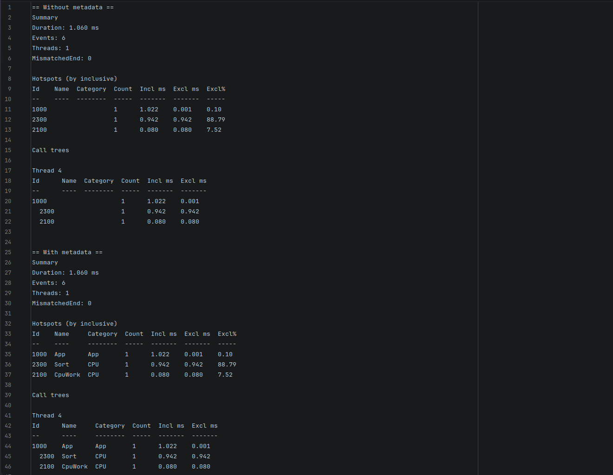

# Устранение неполадок

Ниже — типовые симптомы, причины и короткие фиксы.

## В сессии нет событий

**Симптом:** `EventCount == 0`, отчёт пустой.

**Проверь:**
- `Tracer.Start()` вызван **до** первых `Scope/Flow`
- `Tracer.Stop()` реально был вызван (и сессия не «упала» по исключению раньше)
- id не равен `0` (избегай `id == 0` — это частый источник путаницы)

## Ошибка/предупреждение про `await` и `Scope`

**Причина:** `Scope` — `ref struct`, его нельзя переносить через `await`.

**Решение:** используй `ScopeAsync`.

```csharp
await using (Tracer.ScopeAsync(Ids.Io))
{
    await Task.Delay(10);
}
```

## В отчёте нет имён (только числа)

**Причина:** нет метаданных.

**Решение:**
- добавь `[assembly: TraceId(...)]`
- подключи `EmberTrace.Abstractions` + `EmberTrace.Generator`
- пересобери проект (source generator генерирует и регистрирует провайдер при компиляции)

## Переполнение буфера / «пропали события»

**Причина:** буферы потока переполнены, сработала политика overflow.

**Решение:**
- увеличь `SessionOptions.ChunkCapacity`
- пересмотри частоту/гранулярность instrumentation
- при необходимости поменяй `OverflowPolicy` (`DropNew`, `DropOldest`, `StopSession`)
- проверь лимиты `MaxTotalEvents`, `MaxTotalChunks`, `MaxEventsPerSecond`

## Flow «обрывается»

**Причина:** не вызван `FlowEnd(...)` / `handle.End()`.

**Решение:** закрывай flow в `finally` или через явный жизненный цикл.

## Есть только числовые id в dev‑сборке

**Причина:** нет метаданных, generator не подключён.

**Решение:** включи `EnableRuntimeMetadata = true` или добавь `[assembly: TraceId(...)]`.

См. также:
- [Использование и API](../guides/usage/README.md)
- [Flow и async](../concepts/flows/README.md)

## Скриншоты


